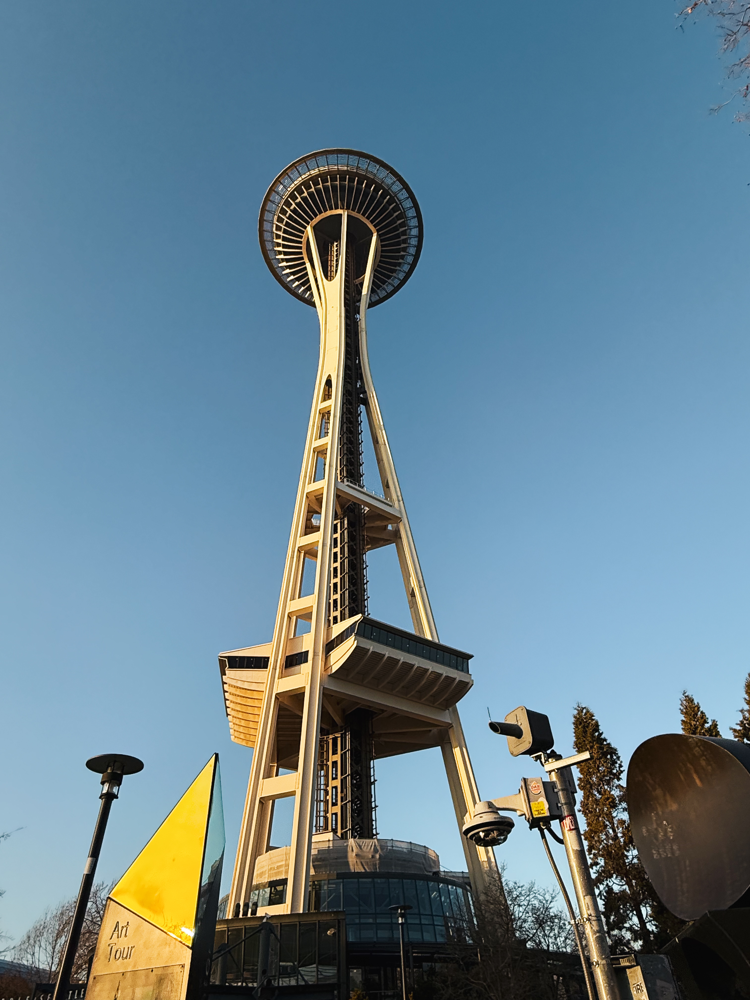
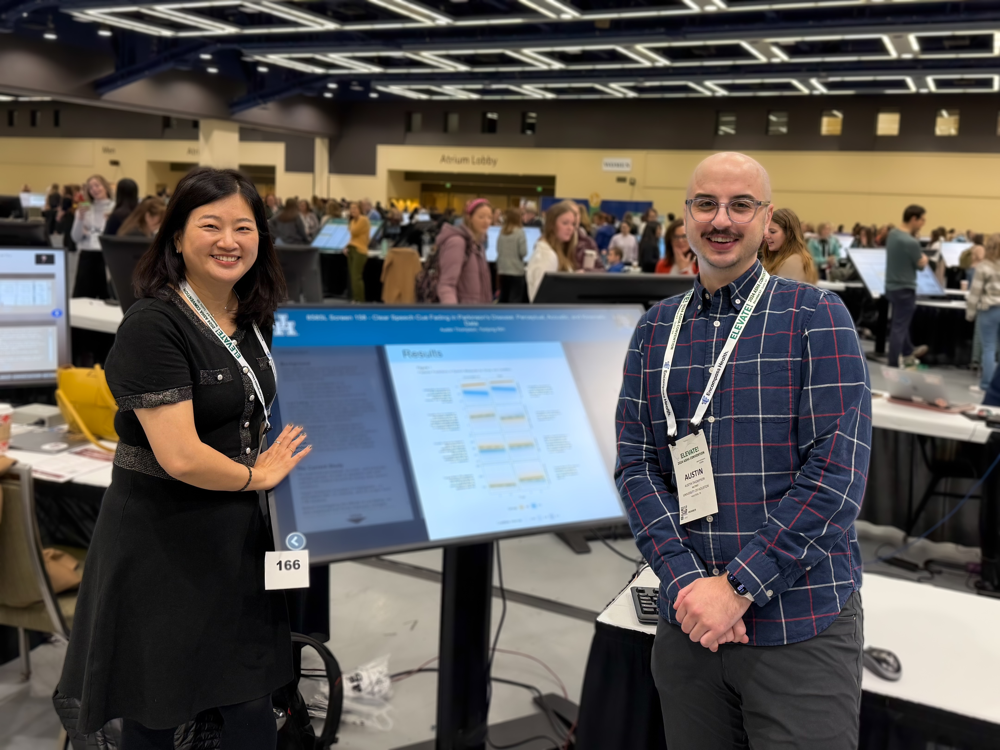
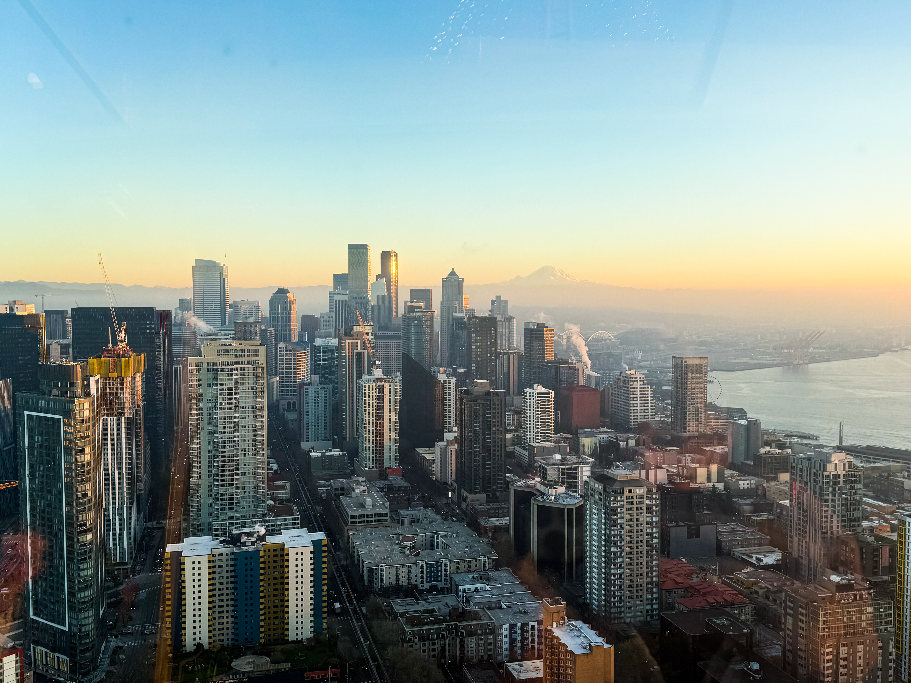
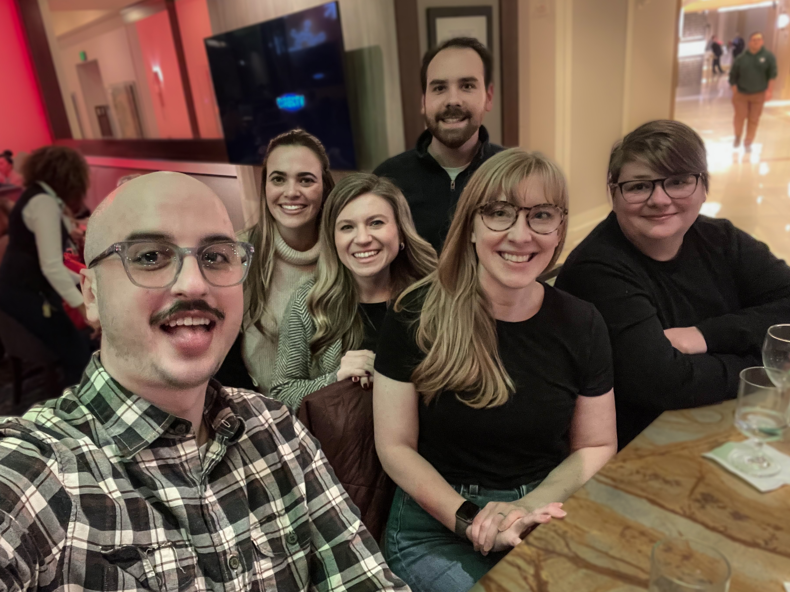
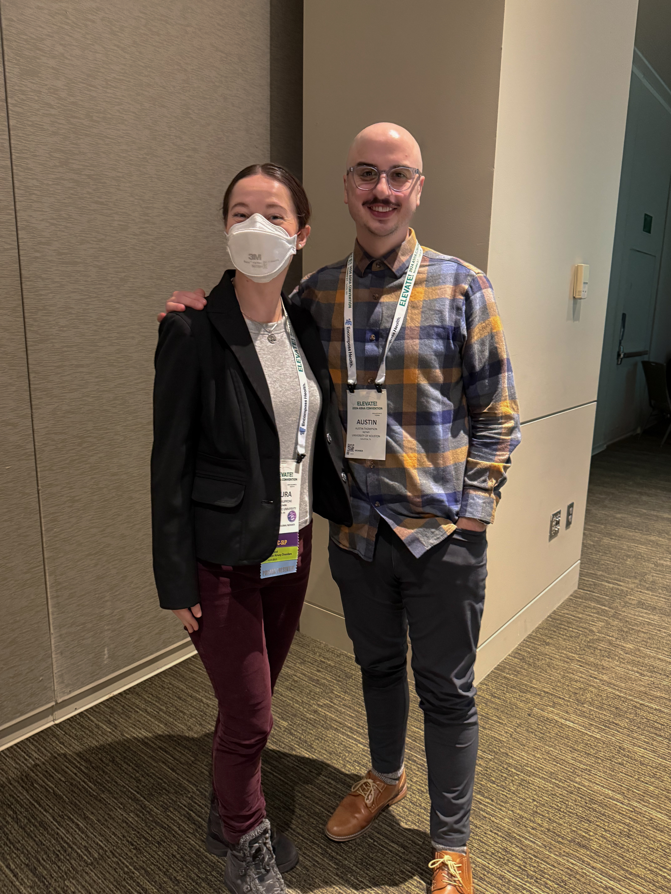
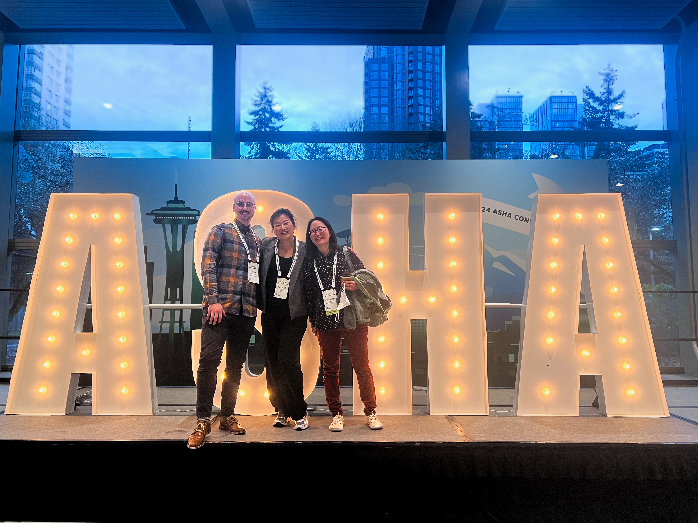

\

Last week was the 2024 annual ASHA Convention in Seattle, WA, where I presented two posters on some preliminary findings from our ongoing studies.

This ASHA was also special for me because I had the opportunity to serve as a mentor through ASHA’s Research Mentor Pair Travel Award (RMPTA) program. My mentee, Maura Philippone, graciously asked me to apply with her, and we were excited to be selected. As part of the program, we attended a research symposium at the conference. Each year focuses on a specific topic, and this year’s was the role of genetics in SLP research. It was an interesting symposium and very educational for me, as I am not very knowledgeable about genetics.

:::::::: columns
::: {.column width="30%"}

:::

::: {.column width="5%"}
<!-- empty column to create gap -->
:::

::: {.column width="30%"}

:::

::: {.column width="5%"}
<!-- empty column to create gap -->
:::

::: {.column width="30%"}

:::
::::::::

I have never truly been to Seattle (except for a few hours before boarding a cruise), so I was excited to have the opportunity to explore the city. I treated myself to a day of being a tourist—I took a ferry, visited the Space Needle, and even went on a ghost tour. 👻

As always, the best part of this conference is catching up with friends and colleagues. It was such a gift to experience it all in such a fun city.
